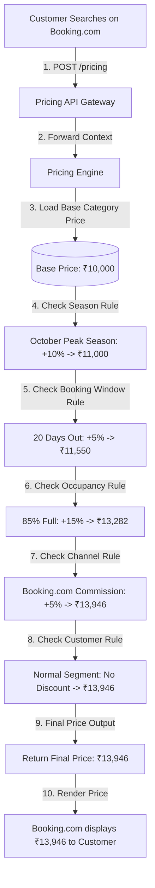

# Dynamic Pricing & Revenue Management Platform — Project Summary

This repository contains the core documentation and technical specifications for the **Dynamic Pricing & Revenue Management Platform**. 

For detailed information, please read the provided documents:
*   📄 **[DPP_Business_Discovery.pdf](DPP_Business_Discovery.pdf)** — Business Discovery & Market Research Report.
*   📄 **[DPP_FRD_SAD.pdf](DPP_FRD_SAD.pdf)** — Functional Requirements Document & System Architecture Design.
*   📝 **[Technical_Implementation_Specification.md](Technical_Implementation_Specification.md)** — Low-Level Design (LLD), Database Schemas, Rule/Pricing Engine Flows, and API Catalog.

---

## 1. What is this project?
This is an internal Dynamic Pricing & Revenue Management Platform for a cruise/travel company. It is not a booking website. Instead, it is a centralized platform where business teams can create, manage, simulate, approve, and publish pricing rules that are consumed by booking systems (Website, Mobile App, OTA, Partner APIs).

## 2. Why are we building this?
Travel inventory (cruise cabins, hotel rooms, flight seats) is perishable. If a cabin is not sold before departure, its value becomes zero. Static pricing cannot maximize revenue because demand changes continuously. 

Current problems include:
*   Manual pricing
*   Spreadsheet management
*   Revenue leakage
*   Multi-channel pricing complexity
*   Slow price updates
*   Human errors
*   Limited flexibility in existing RMS tools

The goal is to automate pricing decisions while allowing business users to configure rules without engineering involvement.

## 3. Existing Market Research
We researched existing Revenue Management Systems such as:
*   IDeaS
*   Duetto
*   Lighthouse
*   Atomize

These platforms already provide dynamic pricing, revenue optimization, demand forecasting, and reporting. However, they cannot fully support company-specific pricing logic, approval workflows, partner contracts, and custom business rules. That's why many enterprises build their own custom pricing platform.

## 4. Product Vision
The platform becomes the single source of truth for pricing. Business users should be able to do the following without writing code:
*   Create pricing rules
*   Configure promotions
*   Simulate prices
*   Approve rules
*   Publish rules
*   Track pricing history
*   Generate reports

## 5. Core Idea
The biggest realization during research was: **This is not just a Dynamic Pricing Tool; it is actually a Business Rules Management Platform (BRMS).** Pricing is only one category of business rules. The Rule Engine is the heart of the platform.

## 6. Business Requirements
The platform supports:
*   Seasonal & Holiday pricing
*   Occupancy & Booking window pricing
*   Customer segment & Platform-specific pricing
*   Promotions & Coupon campaigns
*   Manual overrides & Rule priorities
*   Rule scheduling & Price simulation
*   Audit logs & Analytics reports

## 7. Technical Architecture
Recommended architecture:
*   **Frontend:** React Dashboard
*   **Backend:** NestJS Backend (Modular Monolith, Domain-Driven Design)
*   **Database:** PostgreSQL
*   **Caching & Queues:** Redis & BullMQ
*   **Core Logic:** Rule Engine, Pricing Engine, and Simulation Engine
*   *Designed to scale from MVP to enterprise.*

## 8. Engineering Blueprint
The engineering blueprint defines:
*   Rule lifecycle & versioning
*   Rule builder & execution flow
*   Rule conflict resolution
*   Price simulation & cache strategy
*   Publish workflow
*   Growth architecture & engineering roadmap

## 9. Technical Implementation
The implementation document contains:
*   Database schema & ER diagrams
*   API design & folder structure
*   Authentication flow (JWT + RBAC)
*   Rule Engine, Pricing Engine, and Simulation Engine architecture
*   Redis strategy & Queue architecture
*   Security, Testing, and Sprint roadmap
*   *Acts as the backend implementation specification.*

## 10. Overall Deliverables
We have created:
1.  **Document 1: Business Discovery & Market Research** — *Answers: Why are we building this?*
2.  **Document 2: Functional Requirements** — *Answers: What should the product do?*
3.  **Document 3: System Architecture & Engineering Blueprint** — *Answers: How is the platform structured?*
4.  **Document 4: Technical Implementation Specification** — *Answers: How will engineers actually build it?*

---

## 💡 Practical Walkthrough: Step-by-Step Pricing Scenario

Here is a concrete end-to-end scenario to illustrate how the Rule Engine and Pricing Engine compute a final price in real-time.

### Scenario Details
*   **Cruise:** Goa Cruise (Base Price: ₹10,000)
*   **Travel Date:** 15 October (October = Peak Season)
*   **Cabin Type:** Deluxe
*   **Customer Segment:** Normal Customer (Not VIP)
*   **Sales Channel:** Booking.com (Charges 5% platform mark-up to cover commission)
*   **Booking Date:** 25 September (20 days before departure)
*   **Sailing Occupancy:** 85% (>80% Occupancy threshold)

---

### Step-by-Step Price Calculation Journey



### Explanation of Calculation Stages

1.  **Customer Search & Request Context**  
    The customer searches on Booking.com. The client frontend passes it explicitly as part of the request payload or standard API headers (`X-Channel: BOOKING_COM`). The Pricing Engine receives:
    ```json
    {
      "cruiseId": "GOA101",
      "travelDate": "2026-10-15",
      "cabinType": "DELUXE",
      "adults": 2,
      "channel": "BOOKING_COM",
      "customerType": "NORMAL"
    }
    ```
2.  **Base Price Resolution**  
    The Pricing Engine queries the cached inventory or database for the matching cruise and cabin configuration. Base rate = **₹10,000**.
3.  **Season Rule Check (October Peak Season)**  
    The Rule Engine evaluates if the travel date (15 October) falls under peak season. It matches the October rule (`+10%`).  
    *Calculation:* ₹10,000 + 10% = **₹11,000**.
4.  **Booking Window Rule Check (20 Days Out)**  
    The difference between the booking date (25 September) and the travel date (15 October) is 20 days. The Rule Engine matches the `0-30 Days Out` surcharge rule (`+5%`).  
    *Calculation:* ₹11,000 + 5% = **₹11,550**.
5.  **Occupancy Surcharge Check (85% Occupancy)**  
    The Pricing Engine queries the inventory service and retrieves the current occupancy percentage (85%). It matches the `>80% Occupancy` premium rule (`+15%`).  
    *Calculation:* ₹11,550 + 15% = **₹13,282** (rounded).
6.  **Channel Rule Check (Booking.com Commission)**  
    Since the request context specified `channel: "BOOKING_COM"`, the Rule Engine applies the channel-specific commission markup rule (`+5%`).  
    *Calculation:* ₹13,282 + 5% = **₹13,946**.
7.  **Customer Segment Check (Normal)**  
    The customer type is `"NORMAL"`, so it skips the VIP segment discount rule.
8.  **Final Response Output**  
    The API returns **₹13,946** as the final price, alongside the structured audit breakdown details.

---

### Key Takeaways & Common Questions

*   **How does the engine know the channel?**  
    The client frontend (Website, Mobile App, OTA, or Partner API) passes it explicitly as part of the request payload or standard API headers.
*   **What if the booking was on our own Website?**  
    The request passes `channel: "WEBSITE"`. The Rule Engine runs the exact same pipeline but skips the Booking.com commission surcharge, outputting a lower price of **₹13,282**.
*   **How does it know if a customer is VIP?**  
    When a logged-in user searches, the user membership status is loaded by the auth/user profile module and sent to the pricing query as `customerType: "VIP"`.
*   **Where do rules reside?**  
    PostgreSQL stores the rules permanently as the source of truth, while Redis stores the currently active, optimized rules in memory for sub-millisecond evaluation during searches.