# Technical Implementation Specification: Dynamic Pricing & Revenue Management Platform

This document serves as the single source of truth and Low-Level Design (LLD) for the backend engineering team before starting Sprint 1. It details the complete architecture, database design, rule engine execution, APIs, queue systems, caching strategies, and security protocols.

---

## 1. Overall System Architecture

The platform is designed as a **Modular Monolith** using **Domain-Driven Design (DDD)** principles. This architecture maximizes development velocity, ensures transactional consistency where required, and allows a clean separation of concerns. The system is designed to run in a single process, but the domain modules are decoupled such that they can be migrated into independent microservices in the future.

### 1.1 Module Boundaries and Decoupling
To enforce strict boundaries:
*   **Database Schema Separation:** While sharing a single PostgreSQL instance, modules must only access their own tables. Join queries across domain boundaries are strictly prohibited. Inter-domain data retrieval must go through clean Service interfaces.
*   **Event-Driven Communication:** Modules communicate asynchronously using an in-memory event emitter or Redis-backed message bus for non-blocking operations, and synchronous module-to-module service calls for read-heavy operations.
*   **No Circular Dependencies:** Dependencies must flow downwards. For example, `PricingModule` depends on `RulesModule`, but `RulesModule` has no knowledge of the pricing pipeline execution details.

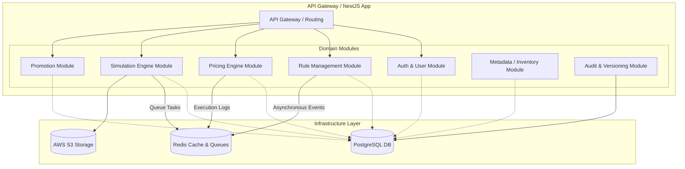

### 1.2 Execution Domain and Layered Architecture
Inside each module, a strict three-layer architecture is implemented:
1.  **API Layer (Controllers & DTOs):** Handles request validation, HTTP routing, and response serialization.
2.  **Domain Layer (Services, Rules & Aggregates):** Contains the core business logic, validation rules, and mathematical engines.
3.  **Persistence Layer (Repositories & Entities):** Handles database queries, data mapping, and transaction boundaries.

---

## 2. Backend Folder Structure

The application will use the standard NestJS architecture, structured strictly by domain features (Modular Monolith) rather than technical layers.

```
src/
├── app.module.ts                  # Bootstraps all feature modules
├── main.ts                        # Entry point of NestJS application
│
├── auth/                          # Authentication Domain
│   ├── controllers/
│   ├── services/
│   ├── strategies/                # Passport JWT & Refresh strategies
│   ├── guards/                    # Auth, RBAC, and Permission Guards
│   ├── entities/
│   └── auth.module.ts
│
├── users/                         # User Management Domain
│   ├── controllers/
│   ├── services/
│   ├── entities/
│   └── users.module.ts
│
├── rules/                         # Pricing Rules Domain (BRMS Hub)
│   ├── controllers/
│   ├── services/
│   ├── engine/                    # Core rule evaluation algorithms
│   ├── entities/                  # Rules, Conditions, Actions schema
│   └── rules.module.ts
│
├── pricing/                       # Price Calculation Pipeline Domain
│   ├── controllers/
│   ├── services/
│   ├── pipeline/                  # Calculators (Base, Season, Occupancy, Promo)
│   ├── entities/
│   └── pricing.module.ts
│
├── simulation/                    # Rule Simulation & Sandbox Domain
│   ├── controllers/
│   ├── services/
│   ├── workers/                   # Background simulation runners (BullMQ)
│   ├── entities/
│   └── simulation.module.ts
│
├── promotions/                    # Promotions and Coupon Logic
│   ├── controllers/
│   ├── services/
│   ├── entities/
│   └── promotions.module.ts
│
├── calendar/                      # Seasons, Holidays, and Special Events
│   ├── controllers/
│   ├── services/
│   ├── entities/
│   └── calendar.module.ts
│
├── reports/                       # Revenue and Simulation Report Exports
│   ├── controllers/
│   ├── services/
│   ├── entities/
│   └── reports.module.ts
│
├── audit/                         # Audit Trail and System Change Logs
│   ├── services/
│   ├── entities/
│   └── audit.module.ts
│
├── settings/                      # Tenant and System Configurations
│   ├── controllers/
│   ├── services/
│   ├── entities/
│   └── settings.module.ts
│
└── shared/                        # Shared Infrastructure & Utilities
    ├── common/                    # Custom global exceptions, filters, pipes
    ├── config/                    # Environment variable configurations
    ├── database/                  # TypeORM / Prisma configuration & migrations
    ├── queues/                    # BullMQ configuration & shared options
    ├── events/                    # Event Emitter & Event classes
    └── decorators/                # Custom decorators (CurrentUser, Roles, Permissions)
```

---

## 3. Complete Database Design

The database schema is designed for PostgreSQL. It includes comprehensive indexing, status tracking, audit columns, soft deletion, and optimistic locking (`version`).

### 3.1 Schema Definition Table

| Table Name | Column Name | Data Type | Constraints | Indexes | Description / Relationships |
| :--- | :--- | :--- | :--- | :--- | :--- |
| **users** | `id` | UUID | PK, DEFAULT `gen_random_uuid()` | HASH | Unique identifier for user |
| | `email` | VARCHAR(255) | UNIQUE, NOT NULL | BTREE | User login email address |
| | `password_hash`| VARCHAR(255) | NOT NULL | - | Argon2id password hash |
| | `first_name` | VARCHAR(100) | NOT NULL | - | User first name |
| | `last_name` | VARCHAR(100) | NOT NULL | - | User last name |
| | `role_id` | UUID | FK -> `roles.id`, NOT NULL | BTREE | Associated RBAC Role |
| | `status` | VARCHAR(50) | NOT NULL, DEFAULT 'ACTIVE'| - | Enum: `ACTIVE`, `INACTIVE`, `SUSPENDED` |
| | `created_at` | TIMESTAMP | NOT NULL, DEFAULT `now()` | - | Audit trail: record creation time |
| | `updated_at` | TIMESTAMP | NOT NULL, DEFAULT `now()` | - | Audit trail: record update time |
| | `deleted_at` | TIMESTAMP | NULL | BTREE | Soft delete timestamp |
| | `version` | INT | NOT NULL, DEFAULT 1 | - | Optimistic locking version |
| **roles** | `id` | UUID | PK, DEFAULT `gen_random_uuid()` | BTREE | Unique identifier for role |
| | `name` | VARCHAR(100) | UNIQUE, NOT NULL | - | Role name (e.g. `PRICING_ANALYST`) |
| | `description` | TEXT | NULL | - | Description of role capabilities |
| | `created_at` | TIMESTAMP | NOT NULL, DEFAULT `now()` | - | Audit trail |
| | `updated_at` | TIMESTAMP | NOT NULL, DEFAULT `now()` | - | Audit trail |
| **permissions**| `id` | UUID | PK, DEFAULT `gen_random_uuid()` | BTREE | Unique identifier for permission |
| | `code` | VARCHAR(100) | UNIQUE, NOT NULL | BTREE | Internal capability code (e.g. `RULES_PUBLISH`)|
| | `name` | VARCHAR(150) | NOT NULL | - | Human readable name |
| **role_permissions**| `role_id` | UUID | PK, FK -> `roles.id` | BTREE | Composite Key Part 1 |
| | `permission_id`| UUID | PK, FK -> `permissions.id` | BTREE | Composite Key Part 2 |
| **companies** | `id` | UUID | PK, DEFAULT `gen_random_uuid()` | BTREE | Unique identifier for company |
| | `name` | VARCHAR(255) | NOT NULL | - | Tenant / Company Name |
| | `currency` | VARCHAR(3) | NOT NULL, DEFAULT 'USD' | - | Base functional currency |
| | `created_at` | TIMESTAMP | NOT NULL, DEFAULT `now()` | - | Audit trail |
| **ships** | `id` | UUID | PK, DEFAULT `gen_random_uuid()` | BTREE | Unique identifier for ship |
| | `company_id` | UUID | FK -> `companies.id`, NOT NULL| BTREE | Associated company |
| | `name` | VARCHAR(255) | NOT NULL | - | Ship Name |
| | `total_capacity`| INT | NOT NULL | - | Total passengers capacity |
| | `created_at` | TIMESTAMP | NOT NULL, DEFAULT `now()` | - | Audit trail |
| **routes** | `id` | UUID | PK, DEFAULT `gen_random_uuid()` | BTREE | Unique identifier for itinerary route |
| | `ship_id` | UUID | FK -> `ships.id`, NOT NULL | BTREE | Associated ship |
| | `departure_port`| VARCHAR(150) | NOT NULL | - | Port of origin |
| | `arrival_port` | VARCHAR(150) | NOT NULL | - | Port of termination |
| | `duration_days`| INT | NOT NULL | - | Route travel duration |
| | `created_at` | TIMESTAMP | NOT NULL, DEFAULT `now()` | - | Audit trail |
| **sailings** | `id` | UUID | PK, DEFAULT `gen_random_uuid()` | BTREE | Specific execution instance of a route |
| | `route_id` | UUID | FK -> `routes.id`, NOT NULL | BTREE | Associated route |
| | `departure_date`| TIMESTAMP | NOT NULL | BTREE | Actual departure date and time |
| | `arrival_date` | TIMESTAMP | NOT NULL | - | Actual arrival date and time |
| | `current_occupancy`| DECIMAL(5,2)| NOT NULL, DEFAULT 0.00 | - | Percentage occupancy (e.g. `85.50`) |
| | `created_at` | TIMESTAMP | NOT NULL, DEFAULT `now()` | - | Audit trail |
| **cabins** | `id` | UUID | PK, DEFAULT `gen_random_uuid()` | BTREE | Unique identifier for a cabin type |
| | `ship_id` | UUID | FK -> `ships.id`, NOT NULL | BTREE | Associated ship |
| | `category` | VARCHAR(100) | NOT NULL | - | Cabin category (e.g. `LUXURY_SUITE`, `INSIDE`) |
| | `base_price` | DECIMAL(12,2)| NOT NULL | - | Base price for calculation |
| | `created_at` | TIMESTAMP | NOT NULL, DEFAULT `now()` | - | Audit trail |
| **rules** | `id` | UUID | PK, DEFAULT `gen_random_uuid()` | BTREE | Rule unique identifier |
| | `company_id` | UUID | FK -> `companies.id`, NOT NULL| BTREE | Tenant identity |
| | `name` | VARCHAR(255) | NOT NULL | - | Rule title |
| | `description` | TEXT | NULL | - | Purpose of rule |
| | `priority` | INT | NOT NULL, DEFAULT 0 | BTREE | Sorting rank for execution |
| | `status` | VARCHAR(50) | NOT NULL, DEFAULT 'DRAFT' | BTREE | Enum: `DRAFT`, `REVIEW`, `APPROVED`, `SCHEDULED`, `PUBLISHED`, `EXPIRED`, `ARCHIVED` |
| | `is_stackable` | BOOLEAN | NOT NULL, DEFAULT TRUE | - | Can this rule combine with others? |
| | `start_date` | TIMESTAMP | NOT NULL | BTREE | Rule active timeframe start |
| | `end_date` | TIMESTAMP | NOT NULL | BTREE | Rule active timeframe end |
| | `created_by` | UUID | FK -> `users.id`, NOT NULL | - | Audit log identity |
| | `updated_by` | UUID | FK -> `users.id` | - | Audit log identity |
| | `deleted_by` | UUID | FK -> `users.id` | - | Audit log identity |
| | `created_at` | TIMESTAMP | NOT NULL, DEFAULT `now()` | - | Audit trail |
| | `updated_at` | TIMESTAMP | NOT NULL, DEFAULT `now()` | - | Audit trail |
| | `deleted_at` | TIMESTAMP | NULL | BTREE | Soft delete mechanism |
| | `version` | INT | NOT NULL, DEFAULT 1 | - | Optimistic locking version |
| **rule_conditions**| `id` | UUID | PK, DEFAULT `gen_random_uuid()` | BTREE | Condition entry identifier |
| | `rule_id` | UUID | FK -> `rules.id`, ON DELETE CASCADE| BTREE | Owner rule |
| | `field` | VARCHAR(100) | NOT NULL | - | Target data variable (e.g. `occupancy`) |
| | `operator` | VARCHAR(50) | NOT NULL | - | Enum: `GT`, `LT`, `EQ`, `IN`, `BETWEEN` etc. |
| | `value` | TEXT | NOT NULL | - | Target comparison threshold value (JSON format) |
| **rule_actions** | `id` | UUID | PK, DEFAULT `gen_random_uuid()` | BTREE | Action entry identifier |
| | `rule_id` | UUID | FK -> `rules.id`, ON DELETE CASCADE| BTREE | Owner rule |
| | `type` | VARCHAR(50) | NOT NULL | - | Enum: `PRICE_ADJUSTMENT`, `OVERRIDE` |
| | `modifier_type`| VARCHAR(50) | NOT NULL | - | Enum: `PERCENTAGE`, `FLAT` |
| | `value` | DECIMAL(12,2)| NOT NULL | - | Positive (increase) or negative (discount) value|
| **rule_versions** | `id` | UUID | PK, DEFAULT `gen_random_uuid()` | BTREE | Historic snapshot record |
| | `rule_id` | UUID | FK -> `rules.id`, ON DELETE CASCADE| BTREE | Reference rule |
| | `version_number`| INT | NOT NULL | - | Monotonically increasing version counter |
| | `payload` | JSONB | NOT NULL | - | Full snapshotted JSON structure of the rule |
| | `created_by` | UUID | FK -> `users.id`, NOT NULL | - | Snapshot author |
| | `created_at` | TIMESTAMP | NOT NULL, DEFAULT `now()` | - | Snapshot timeframe |
| **simulations** | `id` | UUID | PK, DEFAULT `gen_random_uuid()` | BTREE | Simulation run identifier |
| | `name` | VARCHAR(255) | NOT NULL | - | User-friendly simulation name |
| | `rule_snapshots`| JSONB | NOT NULL | - | Array of rules loaded in this scenario |
| | `status` | VARCHAR(50) | NOT NULL, DEFAULT 'PENDING' | - | Enum: `PENDING`, `RUNNING`, `COMPLETED`, `FAILED` |
| | `created_by` | UUID | FK -> `users.id`, NOT NULL | - | Owner user |
| | `created_at` | TIMESTAMP | NOT NULL, DEFAULT `now()` | - | Timeframe |
| | `completed_at` | TIMESTAMP | NULL | - | Timeframe |
| **simulation_results** | `id` | UUID | PK | BTREE | Result entry identifier |
| | `simulation_id`| UUID | FK -> `simulations.id` | BTREE | Simulation relation |
| | `sailing_id` | UUID | FK -> `sailings.id` | - | Target test sailing |
| | `cabin_id` | UUID | FK -> `cabins.id` | - | Target test cabin category |
| | `original_price`| DECIMAL(12,2)| NOT NULL | - | Control price before simulation rules |
| | `simulated_price`| DECIMAL(12,2)| NOT NULL | - | Test price calculated by simulation rules |
| | `variance` | DECIMAL(12,2)| NOT NULL | - | Difference value (`simulated` - `original`) |
| **audit_logs** | `id` | UUID | PK, DEFAULT `gen_random_uuid()` | BTREE | Unique log tracker identifier |
| | `entity_name` | VARCHAR(100) | NOT NULL | BTREE | Target entity type (e.g. `rules`) |
| | `entity_id` | UUID | NOT NULL | BTREE | Target entity primary key ID |
| | `action_type` | VARCHAR(50) | NOT NULL | - | Enum: `CREATE`, `UPDATE`, `DELETE`, `PUBLISH` |
| | `old_values` | JSONB | NULL | - | Snapshot of columns before execution |
| | `new_values` | JSONB | NULL | - | Snapshot of columns after execution |
| | `performed_by` | UUID | FK -> `users.id`, NOT NULL | - | Action executor |
| | `created_at` | TIMESTAMP | NOT NULL, DEFAULT `now()` | BTREE | Action time |

---

## 4. Complete ER Diagram

This logical Entity-Relationship diagram outlines all foreign key links, cardinality mappings, and entity associations.

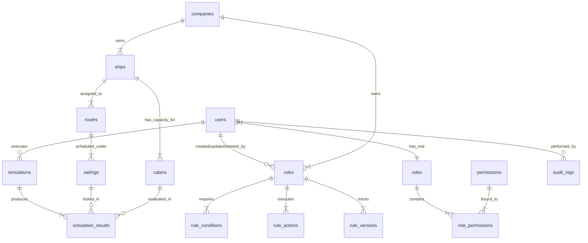

---

## 5. Rule Engine Design

The Rule Engine is a core business-critical engine. It acts as an evaluation processor that retrieves, validates, and runs logical business statements to output price modifiers.

### 5.1 Rule Storage & Representation
Rules are stored in normalized relational structures (`rules`, `rule_conditions`, `rule_actions`) to support rapid querying on indexed criteria. A complete snapshot of rule conditions is also kept as flat JSON files in `rule_versions.payload` for rapid auditing and rollback purposes.

#### Structured Rule Grammar (JSON Spec)
```json
{
  "rule_id": "8f8b80b7-db83-4a11-8be5-618a8be77c22",
  "priority": 90,
  "is_stackable": true,
  "conditions": [
    {
      "field": "occupancy",
      "operator": "GT",
      "value": "80.00"
    },
    {
      "field": "booking_window_days",
      "operator": "LT",
      "value": "7"
    },
    {
      "field": "channel",
      "operator": "EQ",
      "value": "Expedia"
    },
    {
      "field": "customer_segment",
      "operator": "EQ",
      "value": "VIP"
    }
  ],
  "actions": [
    {
      "type": "PRICE_ADJUSTMENT",
      "modifier_type": "PERCENTAGE",
      "value": "20.00"
    }
  ]
}
```

### 5.2 Rule Lifecycle & State Machine
Every rule transitions sequentially through states. Rollbacks trigger immediate archiving of the active rule and the creation of a new draft from the target historic version.

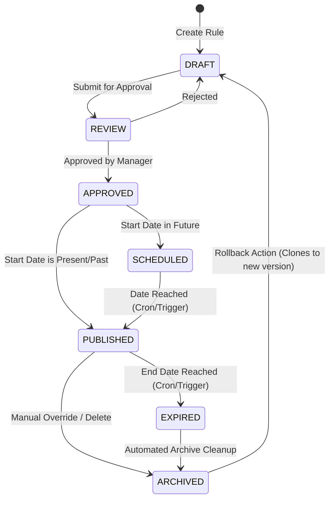

### 5.3 Execution Algorithm & Pipeline

```mermaid
flowchart TD
    A[Start Evaluation Request] --> B[Retrieve Active Rules from Redis Cache]
    B --> C{Rules in Cache?}
    C -- No -- --> D[Query PostgreSQL for Active Rules]
    D --> E[Populate Redis Cache]
    E --> F[Combine with Target Request Metadata]
    C -- Yes --> F
    F --> G[Filter Rules matching Schedule & Routing constraints]
    G --> H[Sort Remaining Rules by Priority DESC]
    H --> I[Initialize Evaluation Loop]
    I --> J[Evaluate Rule Conditions]
    J --> K{All Conditions Met?}
    K -- Yes --> L[Apply Action Modifier to Result List]
    K -- No --> M[Skip Rule]
    L --> N{More Rules in Loop?}
    M --> N
    N -- Yes --> I
    N -- No --> O[Resolve Modifier Conflicts]
    O --> P[Calculate Cumulative Modifiers]
    P --> Q[Generate Base Breakdown Log]
    Q --> R[Return Modifier Action Set]
```

### 5.4 Technical Architecture Details
*   **Evaluation Engine:** To execute conditions cleanly without dangerous evaluations (like JavaScript's `eval()`), the engine uses a map of typed operator handlers.
*   **Operator Handlers Map:**
    *   `GT`: `(contextValue, ruleValue) => Number(contextValue) > Number(ruleValue)`
    *   `LT`: `(contextValue, ruleValue) => Number(contextValue) < Number(ruleValue)`
    *   `EQ`: `(contextValue, ruleValue) => String(contextValue).toLowerCase() === String(ruleValue).toLowerCase()`
    *   `IN`: `(contextValue, ruleValueArray) => ruleValueArray.includes(contextValue)`
    *   `BETWEEN`: `(contextValue, rangeArray) => contextValue >= rangeArray[0] && contextValue <= rangeArray[1]`
*   **Conflict Resolution Protocol:**
    1.  If non-stackable rules are triggered, the non-stackable rule with the **highest priority** takes absolute precedence. All stackable rules evaluated up to that point are discarded.
    2.  If multiple stackable rules apply, they are calculated sequentially (multiplicative stacking or additive stacking, governed by tenant parameter configurations).
    3.  If rules have identical priorities, the engine resolves ties by applying the rule with the oldest creation timestamp (`created_at` ASC).
*   **Rule Caching Structure:** Active rules are kept in a Redis Sorted Set (ZSET), where the score is the rule priority. This keeps rules pre-sorted in cache, eliminating sorting latency during price lookups.

---

## 6. Pricing Engine

The Pricing Engine coordinates calculations step-by-step. It processes incoming requests, queries inventory metadata, executes the Rule Engine, and outputs the final price and calculation breakdown.

### 6.1 Price Calculation Pipeline Flow
Every lookup request goes through a strict multi-stage pipe:

```mermaid
graph LR
    A[Request Input] --> B[1. Fetch Base Category Price]
    B --> C[2. Apply Season Adjustment]
    C --> D[3. Apply Holiday Adjustment]
    D --> E[4. Apply Occupancy Surcharge]
    E --> F[5. Apply Booking Window Multiplier]
    F --> G[6. Apply Channel Modifier]
    G --> H[7. Apply Active Promotions]
    H --> I[8. Calculate Taxes]
    I --> J[Final Price & Breakdown Output]
```

### 6.2 Price Breakdown Schema
Every pricing response must return a detailed calculation breakdown. This ensures full auditability for business analysts and finance teams, answering the core question: *"Why did this price change?"*

```json
{
  "search_context": {
    "sailing_id": "c7a8b340-9755-4bc6-8be9-cfd03429f55e",
    "cabin_id": "a18b76c0-6644-4861-84bb-cd3822d64a2a",
    "channel": "Expedia",
    "customer_segment": "VIP"
  },
  "pricing_summary": {
    "currency": "INR",
    "base_price": 15000.00,
    "total_modifiers": 2000.00,
    "final_price": 17000.00
  },
  "calculation_stages": [
    {
      "stage": "BASE_PRICE",
      "description": "Base cabin tier category rate",
      "modifier_applied": 0.00,
      "running_price": 15000.00
    },
    {
      "stage": "SEASON_ADJUSTMENT",
      "rule_id": "18f8b0b7-db83-4a11-8be5-618a8be77c01",
      "rule_name": "Summer Sailing Premium",
      "modifier_type": "FLAT",
      "modifier_value": 2000.00,
      "running_price": 17000.00
    },
    {
      "stage": "OCCUPANCY_SURCHARGE",
      "rule_id": "28f8b0b7-db83-4a11-8be5-618a8be77c02",
      "rule_name": "High Occupancy Surcharge (>80%)",
      "modifier_type": "PERCENTAGE",
      "modifier_value": 10.00,
      "modifier_calculated": 1500.00,
      "running_price": 18500.00
    },
    {
      "stage": "VIP_DISCOUNT",
      "rule_id": "38f8b0b7-db83-4a11-8be5-618a8be77c03",
      "rule_name": "VIP Customer Segment Offer",
      "modifier_type": "PERCENTAGE",
      "modifier_value": -3.33,
      "modifier_calculated": -500.00,
      "running_price": 18000.00
    },
    {
      "stage": "PROMOTION",
      "rule_id": "48f8b0b7-db83-4a11-8be5-618a8be77c04",
      "rule_name": "Expedia Partner Promotion Code",
      "modifier_type": "FLAT",
      "modifier_value": -1000.00,
      "running_price": 17000.00
    }
  ]
}
```

---

## 7. Simulation Engine

The Simulation Engine acts as an isolated sandbox for testing rules. It allows business analysts to run "what-if" analyses using draft or modified rules against real historical or current occupancy data. This ensures pricing changes are validated before going live.

### 7.1 Sandbox Isolation Flow
*   **Transaction Isolation:** Simulations use a read-only database transaction that simulates rule adjustments. It does not write to the active pricing tables or invalidate the production Redis cache.
*   **Async Execution Architecture:**
    1.  An analyst requests a simulation via the UI, providing a set of modified rules and target sailings.
    2.  The API registers the request, creates a record in `simulations`, and pushes a job to the BullMQ queue (`simulation-queue`).
    3.  A background worker picks up the job and executes the pricing pipeline in memory using the simulation's temporary rules.
    4.  The output is saved directly to `simulation_results`.
    5.  A WebSocket notification is sent to the client UI when the simulation completes.

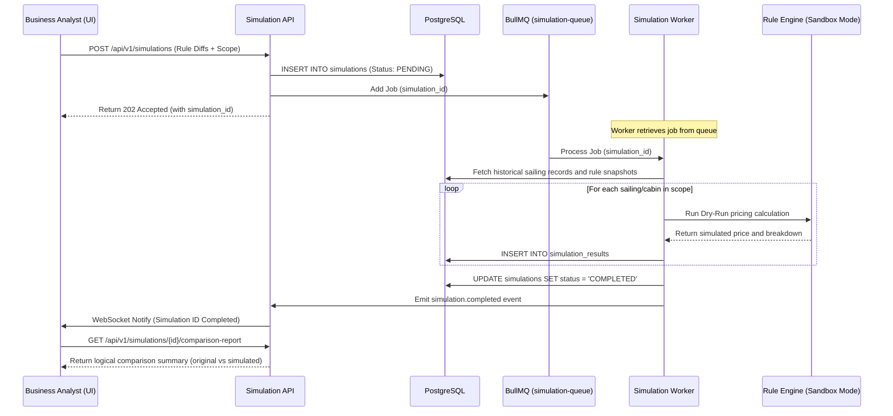

### 7.2 Comparison Metrics & Variance Analysis
The comparison report generates key operational metrics:
*   **Total Revenue Variance:** $\sum (Price_{simulated} - Price_{original})$ across all tested bookings.
*   **Yield Percentage Change:** $\frac{Total Simulated Revenue - Total Original Revenue}{Total Original Revenue} \times 100$
*   **Price Deviation Range:** The maximum price increase and decrease to spot unintended outliers.
*   **Rule Coverage Rate:** Percentage of test bookings that matched at least one simulation rule.

---

## 8. API Design

All endpoints are versioned (`/api/v1`) and use strict REST design principles. Requests and responses return JSON payloads, and inputs are validated using NestJS class-validators.

### 8.1 API Catalog

#### Authentication & User Management
*   `POST /api/v1/auth/login`
    *   *Purpose:* Validate user credentials and return access/refresh tokens.
    *   *Auth Required:* None.
    *   *Request:* `{"email": "analyst@company.com", "password": "SecurePassword123"}`
    *   *Response (200 OK):* `{"access_token": "eyJ...", "refresh_token": "eyJ...", "expires_in": 900}`
    *   *Error Codes:* `401_UNAUTHORIZED`, `400_BAD_REQUEST`
*   `POST /api/v1/auth/refresh`
    *   *Purpose:* Refresh an expired access token using a valid refresh token.
    *   *Auth Required:* Bearer Refresh Token.
    *   *Response (200 OK):* `{"access_token": "eyJ...", "expires_in": 900}`
*   `GET /api/v1/users/me`
    *   *Purpose:* Get profile and permissions information for the currently logged-in user.
    *   *Auth Required:* Bearer Access Token.
    *   *Response (200 OK):* `{"id": "uuid", "email": "analyst@company.com", "roles": ["PRICING_ANALYST"], "permissions": ["RULES_CREATE", "RULES_SIMULATE"]}`

#### Rule Management Module
*   `POST /api/v1/rules`
    *   *Purpose:* Create a new draft pricing rule.
    *   *Auth Required:* JWT with permission `RULES_CREATE`.
    *   *Request:*
        ```json
        {
          "name": "High Occupancy Surcharge",
          "description": "Increase price when cabin occupancy exceeds 80%",
          "priority": 90,
          "is_stackable": true,
          "start_date": "2026-07-01T00:00:00Z",
          "end_date": "2026-12-31T23:59:59Z",
          "conditions": [
            { "field": "occupancy", "operator": "GT", "value": "80.00" }
          ],
          "actions": [
            { "type": "PRICE_ADJUSTMENT", "modifier_type": "PERCENTAGE", "value": "15.00" }
          ]
        }
        ```
    *   *Response (210 Created):* Returns the created rule object including assigned `id` and state `DRAFT`.
*   `PUT /api/v1/rules/{id}`
    *   *Purpose:* Update a draft rule. This creates a new version in the database.
    *   *Auth Required:* JWT with permission `RULES_EDIT`.
    *   *Response (200 OK):* Returns the updated rule with an incremented `version` number.
*   `POST /api/v1/rules/{id}/submit-for-review`
    *   *Purpose:* Change a rule's status to `REVIEW`.
    *   *Auth Required:* JWT with permission `RULES_EDIT`.
    *   *Response (200 OK):* `{"id": "uuid", "status": "REVIEW"}`
*   `POST /api/v1/rules/{id}/approve`
    *   *Purpose:* Approve a rule, transitioning its state to `APPROVED`.
    *   *Auth Required:* JWT with permission `RULES_APPROVE`.
    *   *Response (200 OK):* `{"id": "uuid", "status": "APPROVED"}`
*   `POST /api/v1/rules/{id}/publish`
    *   *Purpose:* Publish an approved rule immediately. This pushes the rule to the active set in PostgreSQL and invalidates the Redis rule cache.
    *   *Auth Required:* JWT with permission `RULES_PUBLISH`.
    *   *Response (200 OK):* `{"id": "uuid", "status": "PUBLISHED"}`
*   `POST /api/v1/rules/{id}/rollback`
    *   *Purpose:* Rollback a rule to a target historical version.
    *   *Auth Required:* JWT with permission `RULES_PUBLISH`.
    *   *Request:* `{"target_version": 2}`
    *   *Response (200 OK):* Returns a new active rule cloned from the historic version payload.

#### Pricing Query Module
*   `POST /api/v1/pricing/calculate`
    *   *Purpose:* Calculate the final price and breakdown for a target sailing search.
    *   *Auth Required:* API Key or JWT Access Token.
    *   *Request:*
        ```json
        {
          "sailing_id": "c7a8b340-9755-4bc6-8be9-cfd03429f55e",
          "cabin_id": "a18b76c0-6644-4861-84bb-cd3822d64a2a",
          "channel": "Expedia",
          "customer_segment": "VIP"
        }
        ```
    *   *Response (200 OK):* Returns the detailed pricing breakdown schema defined in Section 6.2.
    *   *Error Codes:* `404_SAILING_NOT_FOUND`, `404_CABIN_NOT_FOUND`, `400_BAD_REQUEST`

#### Simulation Sandbox Module
*   `POST /api/v1/simulations`
    *   *Purpose:* Trigger an asynchronous simulation run.
    *   *Auth Required:* JWT with permission `RULES_SIMULATE`.
    *   *Request:*
        ```json
        {
          "name": "Q3 Promo Strategy",
          "test_rules": [
            {
              "name": "Simulated Summer Sale",
              "priority": 100,
              "conditions": [{ "field": "season", "operator": "EQ", "value": "SUMMER" }],
              "actions": [{ "type": "PRICE_ADJUSTMENT", "modifier_type": "PERCENTAGE", "value": "-10.00" }]
            }
          ],
          "sailing_scope_ids": ["c7a8b340-9755-4bc6-8be9-cfd03429f55e"]
        }
        ```
    *   *Response (202 Accepted):* `{"simulation_id": "uuid", "status": "PENDING", "eta_seconds": 45}`
*   `GET /api/v1/simulations/{id}`
    *   *Purpose:* Check the status and results summary of a simulation run.
    *   *Auth Required:* JWT with permission `RULES_SIMULATE`.
    *   *Response (200 OK):*
        ```json
        {
          "id": "uuid",
          "status": "COMPLETED",
          "summary": {
            "total_bookings_evaluated": 150,
            "net_revenue_variance": -45000.00,
            "average_price_change": -300.00
          }
        }
        ```

#### Health & Admin Modules
*   `GET /api/v1/health`
    *   *Purpose:* Basic Liveness and Readiness check for service monitoring.
    *   *Auth Required:* None.
    *   *Response (200 OK):* `{"status": "UP", "database": "CONNECTED", "redis": "CONNECTED", "timestamp": "2026-07-03T15:00:00Z"}`

---

## 9. API Flow

This section illustrates how data flows through the system for the two main request paths: price lookups and publishing rules.

### 9.1 High-Performance Price Query Flow (Read Path)
This sequence diagram shows the price calculation path. The system uses a **cache-aside** pattern with Redis to ensure low-latency lookups.

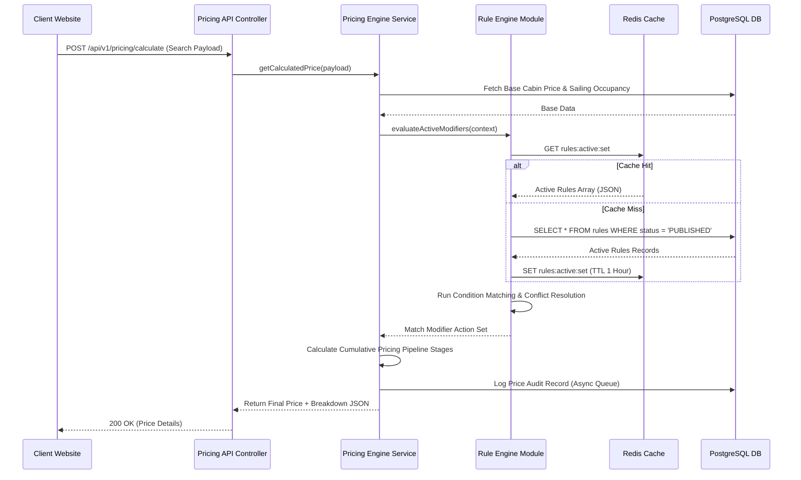

### 9.2 Rule Creation and Publishing Flow (Write Path)
This sequence diagram shows how rules are created, audited, simulated, and published.

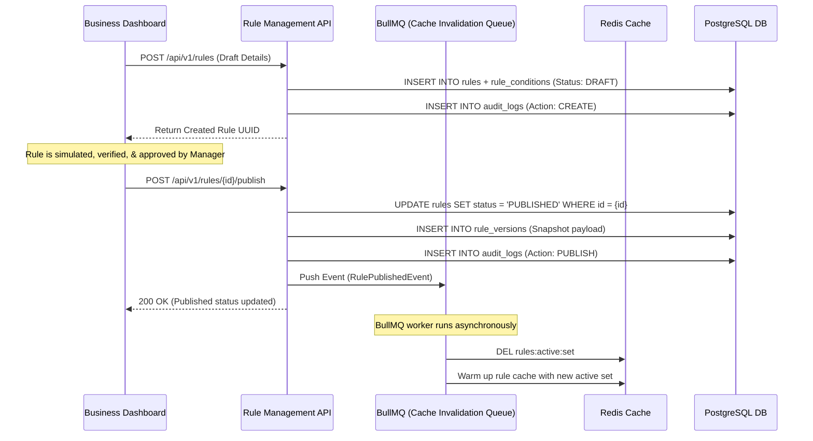

---

## 10. Authentication & Authorization

The platform uses a secure, stateless authentication and role-based authorization model.

### 10.1 Authentication Protocol
*   **JSON Web Tokens (JWT):** Access tokens are signed using `RS256` asymmetric encryption. The public key is exposed via a standard JWKS endpoint to allow other services to verify tokens without calling the Auth service.
*   **Refresh Tokens:** Stored in PostgreSQL with an Argon2id hash. When an access token expires, the client sends the refresh token to receive a new access token. This keeps access token lifetimes short (15 minutes).
*   **Token Lifespans:**
    *   Access Token: 15 minutes (non-configurable).
    *   Refresh Token: 7 days.

### 10.2 Role-Based Access Control (RBAC) Matrix

Permissions are structured as fine-grained codes. Roles are collections of these permissions.

| Permission Code | Description | Super Admin | Revenue Manager | Pricing Analyst | Operations | Finance |
| :--- | :--- | :---: | :---: | :---: | :---: | :---: |
| `USERS_MANAGE` | Create and suspend user accounts | ✔ | - | - | - | - |
| `RULES_CREATE` | Create a new pricing rule in draft | ✔ | ✔ | ✔ | - | - |
| `RULES_EDIT` | Edit any draft pricing rule | ✔ | ✔ | ✔ | - | - |
| `RULES_APPROVE` | Approve rules submitted for review | ✔ | ✔ | - | - | - |
| `RULES_PUBLISH` | Publish approved rules to production | ✔ | ✔ | - | ✔ | - |
| `RULES_SIMULATE`| Run pricing simulations | ✔ | ✔ | ✔ | - | - |
| `AUDIT_VIEW` | Read change log tables | ✔ | ✔ | - | - | ✔ |
| `REPORTS_VIEW` | Read revenue variance reports | ✔ | ✔ | ✔ | - | ✔ |

---

## 11. Queue Architecture

The platform uses **BullMQ** (backed by Redis) to manage asynchronous tasks and background jobs. This prevents long-running operations, like reports and simulations, from blocking the main API thread.

### 11.1 Queue Topology

```
Redis (Queue Storage)
├── [simulation-queue]  ──> Workers run dry-runs on historical data
├── [cache-warmup-queue] ──> Workers rebuild rule cache on new publications
├── [audit-log-queue]    ──> Workers write audit logs to database out-of-band
└── [report-queue]       ──> Workers compile and export CSV summaries to S3
```

### 11.2 Queue Strategy & Reliability

```mermaid
flowchart TD
    A[Worker Picks Up Job] --> B{Process Execution}
    B -- Success --> C[Complete Job & Delete from Active Queue]
    B -- Failure --> D{Retry Count < Max Retries 3?}
    D -- Yes -- --> E[Apply Exponential Backoff: delay = 2^retry * 1000ms]
    E --> F[Re-enqueue Job]
    D -- No --> G[Move Job to Dead Letter Queue DLQ]
    G --> H[Emit alert.dlq event to monitoring dashboard]
```

---

## 12. Redis Strategy

Redis is a key part of the platform's performance strategy. It acts as both an API cache and the storage backend for BullMQ.

### 12.1 Cache Key Schema & Strategy

| Key Pattern | Data Structure | TTL | Invalidation Trigger | Purpose |
| :--- | :--- | :--- | :--- | :--- |
| `rules:active:set` | ZSET | 1 Hour | Rule Published, Rule Expired | Stores sorted active rules |
| `sailing:occupancy:{sailingId}`| STRING | 5 Minutes| New ticket booking event | Caches current occupancy |
| `price:calculated:{hash}` | STRING | 10 Minutes| Rule changes, occupancy shift | Caches pricing lookup outputs|
| `session:user:{userId}` | STRING | 15 Minutes| Logout, password modification | Caches active JWT status |

*   **Cache Warming:** When a new rule is published, the invalidation worker deletes `rules:active:set`. It then queries the database for the active rules and repopulates the Redis cache. This prevents cache stampedes during peak traffic.
*   **Cache Bypass / Fallback:** If Redis goes down, a fallback interceptor catches the connection exception, logs a high-severity alert, and routes queries directly to PostgreSQL. This degrades performance (higher latency) but keeps the platform online.

---

## 13. Event Driven Architecture

The system uses an asynchronous event architecture. When domain events occur, they are dispatched to update caches, send notifications, or log audit trails.

### 13.1 Platform Event Catalog

```mermaid
grid
    RuleCreatedEvent : Dispatched when rule is first saved. Triggers draft audit log.
    RuleUpdatedEvent : Dispatched on changes. Increments version and stores historic snapshot.
    RulePublishedEvent : Dispatched when rule goes live. Invalidates Redis cache.
    RuleExpiredEvent : Dispatched by schedule scheduler. Moves status to EXPIRED.
    SimulationCreatedEvent : Enqueues new background task to simulation queue.
    PriceCalculatedEvent : Dispatched after every lookup. Used for analytics and audit.
    PromotionActivatedEvent : Fires when code is redeemed. Updates promotion usage counters.
```

---

## 14. Validation Layer

The platform enforces strict validation rules at every layer of the request cycle to ensure data integrity and system reliability.

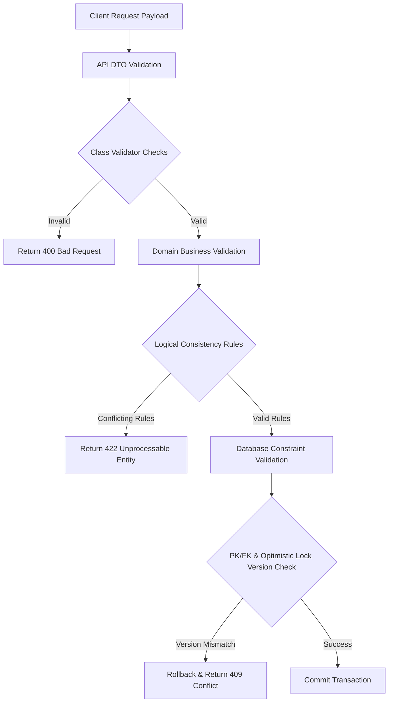

### 14.1 Validation Rules & Constraints
*   **Rule Conflict Validation:** Before saving a rule, the system checks for overlapping date ranges, target channels, and cabin categories. If a rule has the exact same conditions as an existing rule but a different priority, the system flags it for review.
*   **Date Window Check:** A rule's `start_date` must be at least 5 minutes in the future, and its `end_date` must be strictly after the `start_date`.
*   **Simulation Check:** Before a rule can be approved, it must run through a simulation to verify it doesn't cause negative pricing anomalies.

---

## 15. Error Handling

The application uses global exception filters to catch errors and return consistent, structured JSON responses to the client.

### 15.1 Error Response Payload
```json
{
  "success": false,
  "error_code": "409_OPTIMISTIC_LOCK_FAILED",
  "message": "The resource was modified by another user. Please reload the data.",
  "timestamp": "2026-07-03T15:05:00Z",
  "path": "/api/v1/rules/8f8b80b7-db83-4a11-8be5-618a8be77c22",
  "details": {
    "expected_version": 2,
    "received_version": 3
  }
}
```

### 15.2 Global Error Classification Matrix

| Error Class | Example Scenario | HTTP Status | Internal Error Code | Recovery Protocol |
| :--- | :--- | :--- | :--- | :--- |
| **Validation** | Missing required request properties | 400 Bad Request | `400_INVALID_DTO_PAYLOAD` | Client fixes schema and resubmits request |
| **Authentication**| Invalid or expired token | 401 Unauthorized| `401_EXPIRED_JWT_TOKEN` | Client uses refresh token to get new JWT |
| **Authorization** | Analyst attempts to publish a rule | 403 Forbidden | `403_INSUFFICIENT_PERMISSIONS` | Restrict UI view; request supervisor approval |
| **Concurrency** | Two users edit the same rule simultaneously | 409 Conflict | `409_OPTIMISTIC_LOCK_FAILED` | Reload entity details and prompt user to retry |
| **Business Logic**| Activating an unapproved rule | 422 Unprocessable| `422_RULE_NOT_APPROVED` | Block status update until rule state is APPROVED |
| **Infrastructure**| Redis cache connection fails | 500 Internal | `500_REDIS_CONN_TIMEOUT` | Bypass cache layer and query database directly |

---

## 16. Logging

The platform uses structured JSON logging to collect and organize log data.

```json
{"timestamp":"2026-07-03T15:06:12Z","level":"info","context":"PricingEngine","message":"Price calculation resolved successfully","sailing_id":"c7a8b340","final_price":17000.00,"latency_ms":12}
```

### 16.1 Specialized Log Streams

```
Application Logger (Pino JSON Format)
├── pricing-engine-trace.log ──> Logs every pricing lookup with inputs and calculations
├── rule-engine-audit.log    ──> Logs details of matching rules and applied modifiers
└── security-access.log      ──> Logs login failures, token refreshes, and access violations
```

---

## 17. Monitoring

Monitoring is configured to track performance metrics and ensure system health.

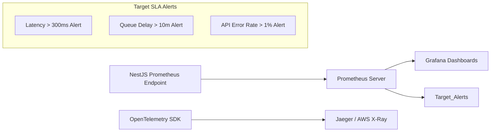

*   **System Health Checks:** The `/api/v1/health` endpoint runs database and Redis ping checks every 10 seconds.
*   **Key Performance Indicators (KPIs):**
    *   `pricing_request_duration_ms`: Tracks API response latency (SLA: 95th percentile < 300ms).
    *   `simulation_job_processing_seconds`: Tracks background simulation runtimes.
    *   `redis_cache_hit_rate`: Tracks the percentage of pricing lookups served from cache.

---

## 18. Security

The platform implements security measures aligned with OWASP top standards to protect sensitive pricing data.

*   **Rate Limiting (Throttle Control):**
    *   Pricing lookup endpoints: Limit of 5,000 requests per minute per API key.
    *   Authentication endpoints: Limit of 5 login attempts per window per IP address.
*   **SQL Injection Prevention:** Database queries are written using typed parameters. Raw SQL queries are prohibited.
*   **Cross-Site Scripting (XSS) Mitigation:** Request inputs are sanitized, and the API gateway injects strict security headers:
    *   `Content-Security-Policy: default-src 'none';`
    *   `X-Content-Type-Options: nosniff`
    *   `Strict-Transport-Security: max-age=63072000; includeSubDomains; preload`
*   **Secrets Management:** Environment secrets (JWT keys, database passwords) must not be stored in code. They are retrieved at runtime from a secure store like AWS Secrets Manager or HashiCorp Vault.

---

## 19. Deployment

The system is deployed using Docker containers orchestrated by Amazon ECS or Kubernetes.

### 19.1 Target Architecture & Scaling

```mermaid
graph TD
    Client[Client Traffic] --> Nginx[Nginx Load Balancer]
    
    subgraph App Cluster (Horizontal Auto-scaling)
        Nginx --> Instance1[NestJS Pod 1]
        Nginx --> Instance2[NestJS Pod 2]
    end

    subgraph Cache & Queue Cluster
        Instance1 --> RedisPool[(Redis Primary)]
        Instance2 --> RedisPool
        RedisPool <--> RedisReplica[(Redis Replica)]
    end

    subgraph Database Layer
        Instance1 --> DBPrimary[(PostgreSQL Primary - Writes)]
        Instance2 --> DBPrimary
        DBPrimary -.-> DBReplica[(PostgreSQL Replica - Read Only)]
        Instance1 -. Read Queries .-> DBReplica
    end
```

*   **PostgreSQL Read-Write Split:** To handle high lookup volume, the application routes write operations (rule creation, audit logs) to the primary database, and read-only operations (category lookups, analytics queries) to database replicas.
*   **Auto-scaling Rules:** The application scales horizontally by adding or removing pods based on resource utilization:
    *   Add instance if average CPU utilization exceeds 70% for 3 consecutive minutes.
    *   Add instance if average Memory usage exceeds 80% for 3 consecutive minutes.

---

## 20. Testing Strategy

The testing strategy ensures code quality and reliability across all modules.

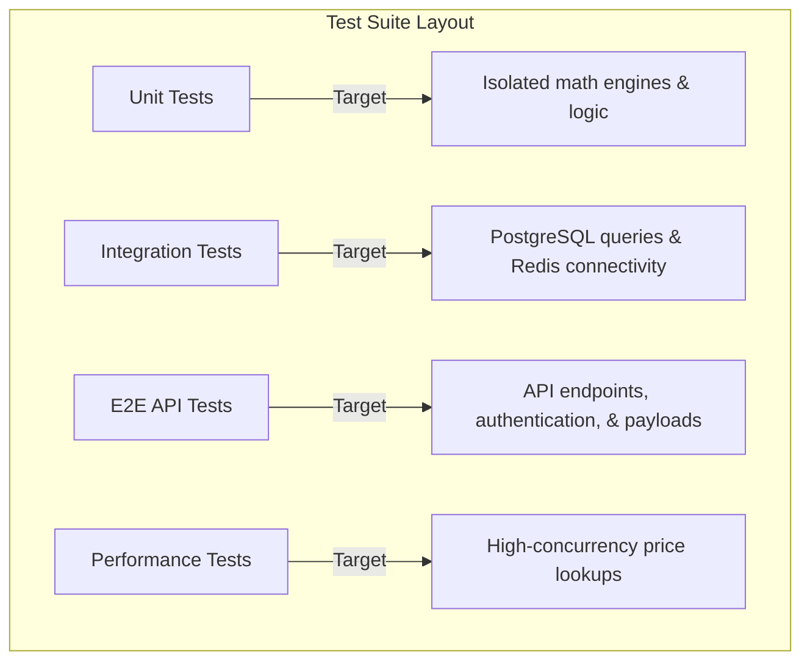

### 20.1 Test Coverage Requirements
*   **Unit Tests:** Must cover 100% of the pricing calculation pipeline and the rule evaluation operators.
*   **Integration Tests:** Must cover database transactions, soft delete filters, and optimistic locking logic.
*   **Performance Testing (Load Generation):** Tests use tools like k6 to verify the pricing API can handle at least 5,000 requests per second with latency under 300ms.

---

## 21. Implementation Order

The implementation roadmap is structured into 7 distinct sprints.

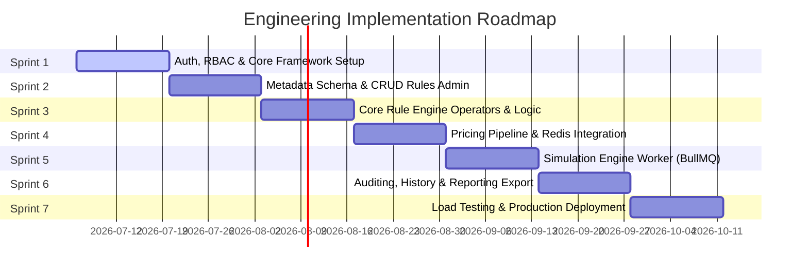

### 21.1 Core Roadmap Phases

#### Sprint 1: Foundation (Database & Auth Setup)
*   **Deliverables:** Establish PostgreSQL database schemas, TypeORM entity mappings, migrations, Passport JWT authentication, and RBAC guard middleware.
*   **Dependencies:** Database connection configurations must be finalized.

#### Sprint 2: Metadata & Rules Administration
*   **Deliverables:** Implement CRUD APIs for rules, conditions, and actions, and set up validation logic.
*   **Dependencies:** Successful completion of Sprint 1 schemas.

#### Sprint 3: Rule Evaluation Engine
*   **Deliverables:** Build the core Rule Engine, operator handlers, priority sorting, and conflict resolution logic.
*   **Dependencies:** Rules database tables from Sprint 2.

#### Sprint 4: Pricing Pipeline Integration
*   **Deliverables:** Implement the pricing stages (Base Price -> Season -> Holiday -> Occupancy -> Discount) and integrate Redis caching.
*   **Dependencies:** Core evaluation engine from Sprint 3.

#### Sprint 5: Simulation Sandbox
*   **Deliverables:** Setup BullMQ workers to run pricing simulations asynchronously in isolated transactions.
*   **Dependencies:** Pricing pipeline from Sprint 4.

#### Sprint 6: Audit, Versioning & Reports
*   **Deliverables:** Implement historical version snapshots, database change auditing, and Excel/CSV report exports to S3.
*   **Dependencies:** Simulation engine from Sprint 5.

#### Sprint 7: Hardening, Performance & Deployment
*   **Deliverables:** Conduct load tests using k6, configure Docker environments, configure Nginx routing, and complete production deployment pipelines.
*   **Dependencies:** Complete system functionality.

---

## 22. Future Architecture

To support long-term growth, the system is designed to scale and integrate advanced capabilities.

### 22.1 Multi-Tenancy Architecture
*   **Data Partitioning:** The database is designed for multi-tenancy. Core tables include a `company_id` tenant identifier column. High-performance queries must include this ID in their where clauses (`WHERE company_id = ?`) to ensure data isolation.
*   **Schema Isolation (Future):** As the platform grows, it can migrate to a schema-per-tenant model. In this setup, the API gateway routes incoming requests to a specific PostgreSQL schema based on the tenant identifier in the JWT token.

### 22.2 AI Pricing & Forecasting Integration
*   **Asynchronous AI Pipeline:** The platform will support machine learning models that generate pricing recommendations based on historical demand patterns.
*   **Data Export (S3):** Every 24 hours, an automated BullMQ worker will export price calculation logs and occupancy data to AWS S3. An external AI service (running Python/TensorFlow) will consume this data to train forecasting models and push suggested pricing adjustments back to the platform via the API.

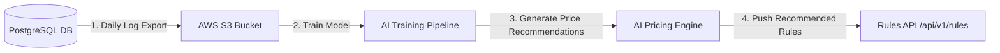
